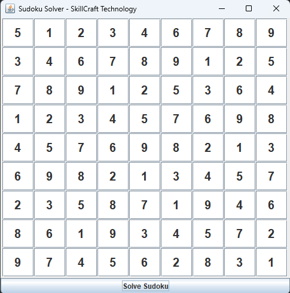

# Sudoku Solver (Task 03) - Java GUI

This project is a Sudoku Solver that allows users to input a Sudoku puzzle using a simple Java Swing GUI and solve it automatically using a backtracking algorithm.

## 📌 Task Description

Create a program that solves Sudoku puzzles automatically. The program should:
- Take an input grid representing an unsolved Sudoku puzzle.
- Use an algorithm to fill in the missing numbers and solve the puzzle.

## 🧩 Features

- 9x9 Sudoku input grid using Java Swing.
- User-friendly interface to input puzzle values.
- “Solve Sudoku” button to compute and display the solution.
- Uses backtracking algorithm for solving.

## 🛠️ Technologies Used

- Java
- Java Swing (GUI)
- Backtracking Algorithm

## 🚀 How to Run

1. **Clone this repository**
   ```bash
   git clone https://github.com/yourusername/sudoku-solver-java.git
## 🖼️ GUI Preview

